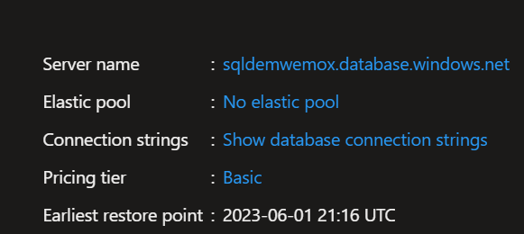
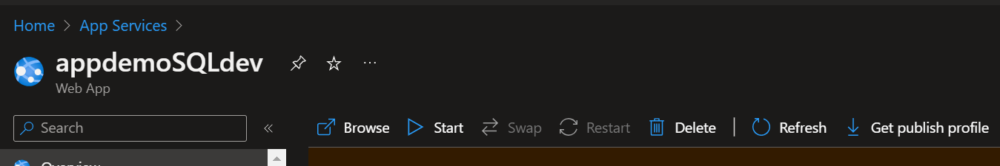
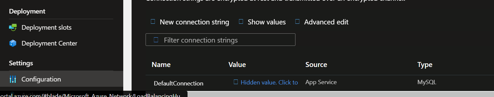

# GitHub Action CI/CD AppService with SQL
Web API Project using .NET 5

## Technologies
- .NET 5
- Entity Framework 5
- Fluent API
- AutoMapper
- Swagger
- SQL Server

## Introduccion:

Este proyecto tiene la finalidad de hacer un proceso CI/CD utilizando GitHub Action en un entorno cloud de Azure. Para ello se dispone en este repositorio el codigo fuente de una applicacion que dispone diferentes endopints posibles de explorar por el swagger en nuestro app service en Azure. La misma aplicacion se conecta a una database en SQL Serve en Azure.

### API 

Dentro del directorio ***/src*** se encuntra los proyectos que utilizaremos. 
BookStore.API cuenta con el _.csjproj_ que publicaremos.

## SQL Server
Se creo una database en un SQL Server en Azure. Una vez creado podemos obtener el campo connectionstring necesario para vicular con nuestra api.

Dentro de este directorio se encuntra el Dockerfile necesario para contruir nuestra imagen para el contenedor que desplegaremos luego. 

##App Service 

Debe crear una instancia de app service en Azure para en este caso un proyecto .NET. Una vez creado nuestro app service en Azure en la parte de configuracion pondremos el valor copiado connection string de nuestro recurso de SQL.

Tambien vamos a descargar el **PUBLISH PROFILE** de nuestra instancia para utilizarlo en el pipeline para el deployment. 

## Gitflow

Siguiendo estrategias de [Gitflow][flow] dispondemos de una rama _develop_ en la que tiene que ser utilizada para trabajar el codigo fuente. Dejando la rama _main_ como rama productiva. 

[flow]: https://www.atlassian.com/es/git/tutorials/comparing-workflows/gitflow-workflow

Dentro de la carpeta ***/.github/workflows***  tenemos disponible nuestros pipelines para desplegar en un app service de entorno dev con su base replicada de prod, y el pipeline de prod que es similar, ya que despleiga a un entorno prod. 

